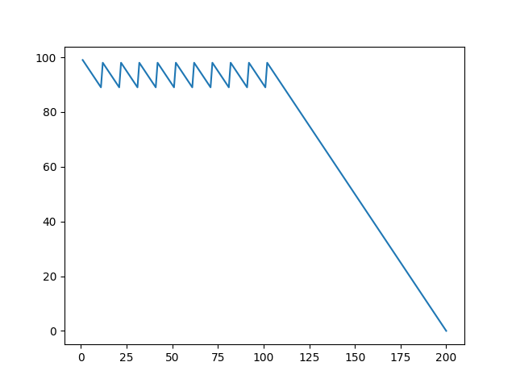
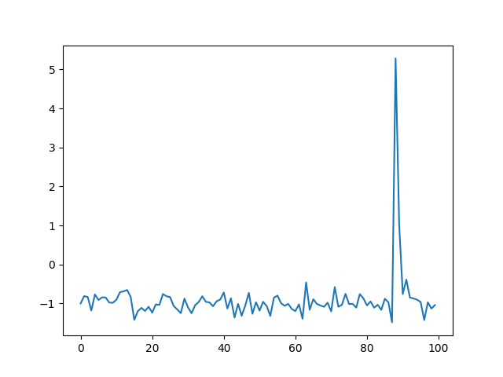

# Learning-Machine-Learning

## Simple Q-Learn Philosophy (?) Realization

_(Or not? Open for comments!)_

### Task

Assume here's a little baby, who's always hungry.  

His `hungriness` is quantified into `100` levels.
Starting at `100`, for every second passed, he will be a little bit hungrier,
  in another word `hungriness -= 1`.
And if his `hungriness` decreases to `0`, he'll cry for mom,
  which is pretty bad :joy:  

However, we have 10 bottles of milk in the fridge.
The consumption of each bottle, will add `10` to `hungriness`.
And our goal is to develop a policy, to keep him from
  calling mom as long as possible!  

### Goal

The optimum policy, which is obvious, is **feeding him every 10 seconds**.  

### Result of My Realization

Type `./main.py` to run.
After training, the following two images will pop out.  

1. `time`-`hungriness` figure  

  

2. `hungriness`-`Q-val` figure  

  

**NOTE:** Result may _highly_ depends on your luck!  

### Dependencies

`matplotlib` and **that's all**.  
I'm considering moving to `pytorch`,
all the `tf.Graph` thing is kinda C-fashion :mask:  

### Update at 13th, Oct

I've added the sum of `hungriness` to the `score`, meaning that the model
  can no longer feed the baby when his `hungriness` is low, for the baby
  may also cry.  
That is to say, the model now has to find the maximum threshold value to
  trigger `Baby.feed()`, which, again obviously, should be `90`.  

And the model found it!  

1. `time`-`hungriness` figure

  

2. `hungriness`-`Q-val` figure

  
